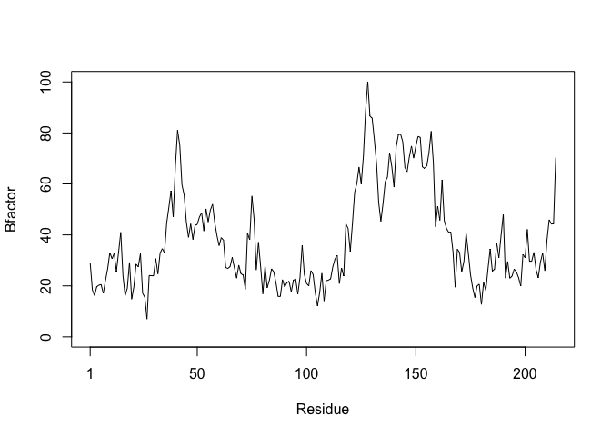
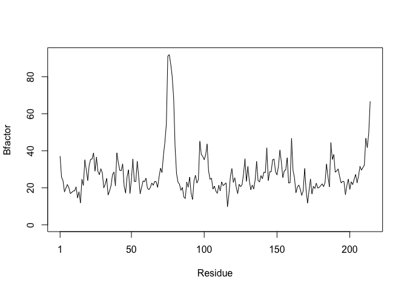
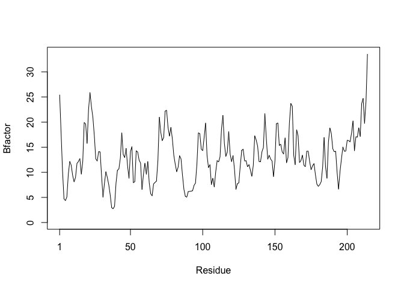

Class 6 R Functions
================
Asha Goodman
1/25/2019

File reading (again!)
---------------------

Here we try to use **read.table()** and friends to input some example data into R.

Lets insert a code chunk.

``` r
read.csv("https://bioboot.github.io/bggn213_S18/class-material/test1.txt")
```

    ##   Col1 Col2 Col3
    ## 1    1    2    3
    ## 2    4    5    6
    ## 3    7    8    9
    ## 4    a    b    c

``` r
file2  <- "https://bioboot.github.io/bggn213_S18/class-material/test2.txt"
read.csv(file2, sep = "$")
```

    ##   Col1 Col2 Col3
    ## 1    1    2    3
    ## 2    4    5    6
    ## 3    7    8    9
    ## 4    a    b    c

``` r
file3 <- "https://bioboot.github.io/bggn213_S18/class-material/test3.txt"
data3 <- read.table(file3)
data3
```

    ##   V1 V2 V3
    ## 1  1  6  a
    ## 2  2  7  b
    ## 3  3  8  c
    ## 4  4  9  d
    ## 5  5 10  e

R Functions
-----------

My first function

``` r
add <- function(x, y=1) {
  #sum x and y
  x + y
}
```

Lets use the **add** function

``` r
add(1,50)
```

    ## [1] 51

This is a purposeful error: add(x=1,y="b")

Our Second Function
===================

``` r
rescale <- function(x) {
 rng <-range(x)
 (x - rng[1]) / (rng[2] - rng[1])
}
```

How would our function work here?

``` r
rescale( c(1,2,NA,3,10) )
```

    ## [1] NA NA NA NA NA

Well we have to change our function to omit "NA"s rescale &lt;- function(x) { rng &lt;-range(x, **na.rm=true**) (x - rng\[1\]) / (rng\[2\] - rng\[1\]) }

``` r
rescale <- function(x) {
 rng <-range(x, na.rm=T)
 (x - rng[1]) / (rng[2] - rng[1])
}
rescale( c(1,2,NA,3,10))
```

    ## [1] 0.0000000 0.1111111        NA 0.2222222 1.0000000

Or here?

rescale( c(1,10,”string”) )

rescale &lt;- function(x) { rng &lt;-range(...) (x - rng\[1\]) / (rng\[2\] - rng\[1\]) rescale( c(1,10,”string”) ) \# Print Function

``` r
rescale3 <- function(x, na.rm=TRUE, plot=FALSE)
{
 if(na.rm) {
 rng <-range(x, na.rm=na.rm)
 } else {
 rng <-range(x)
 }
 print("Hello")
 answer <- (x - rng[1]) / (rng[2] - rng[1])

 print("is it me you are looking for?")
 if(plot) {
 plot(answer, typ="b", lwd=4)
 }
 print("I can see it in ...")
 return(answer)
}
rescale3(1:10)
```

    ## [1] "Hello"
    ## [1] "is it me you are looking for?"
    ## [1] "I can see it in ..."

    ##  [1] 0.0000000 0.1111111 0.2222222 0.3333333 0.4444444 0.5555556 0.6666667
    ##  [8] 0.7777778 0.8888889 1.0000000

Using the Bio3d package
-----------------------

Have to go to the library to get the package before you use it every time.

``` r
library(bio3d)
```

What's in this pdb?

``` r
pdb <- read.pdb("1hbs")
```

    ##   Note: Accessing on-line PDB file

``` r
pdb
```

    ## 
    ##  Call:  read.pdb(file = "1hbs")
    ## 
    ##    Total Models#: 1
    ##      Total Atoms#: 9104,  XYZs#: 27312  Chains#: 8  (values: A B C D E F G H)
    ## 
    ##      Protein Atoms#: 8760  (residues/Calpha atoms#: 1148)
    ##      Nucleic acid Atoms#: 0  (residues/phosphate atoms#: 0)
    ## 
    ##      Non-protein/nucleic Atoms#: 344  (residues: 8)
    ##      Non-protein/nucleic resid values: [ HEM (8) ]
    ## 
    ##    Protein sequence:
    ##       VLSPADKTNVKAAWGKVGAHAGEYGAEALERMFLSFPTTKTYFPHFDLSHGSAQVKGHGK
    ##       KVADALTNAVAHVDDMPNALSALSDLHAHKLRVDPVNFKLLSHCLLVTLAAHLPAEFTPA
    ##       VHASLDKFLASVSTVLTSKYRVHLTPVEKSAVTALWGKVNVDEVGGEALGRLLVVYPWTQ
    ##       RFFESFGDLSTPDAVMGNPKVKAHGKKVLGAFSDGLAHLDNLKGT...<cut>...HKYH
    ## 
    ## + attr: atom, xyz, seqres, helix, calpha,
    ##         remark, call

Can you improve this analysis code?
===================================

``` r
library(bio3d)
Test <- read.pdb("4AKE") # kinase with drug
```

    ##   Note: Accessing on-line PDB file

``` r
Control <- read.pdb("1AKE") # kinase no drug
```

    ##   Note: Accessing on-line PDB file
    ##    PDB has ALT records, taking A only, rm.alt=TRUE

``` r
Test2 <- read.pdb("1E4Y") # kinase with drug
```

    ##   Note: Accessing on-line PDB file

``` r
Test.chainA <- trim.pdb(Test, chain="A", elety="CA")
Control.chainA <- trim.pdb(Control, chain="A", elety="CA")
Test2.chainA <- trim.pdb(Test2, chain="A", elety="CA")
Test.b <- Test.chainA$atom$b
Control.b <- Control.chainA$atom$b
Test2.b <- Test2.chainA$atom$b
plotb3(Test.b, sse=Test.chainA, typ="l", ylab="Bfactor")
```


``` r
plotb3(Control.b, sse=Control.chainA, typ="l", ylab="Bfactor")
```


``` r
plotb3(Test2.b, sse=Test2.chainA, typ="l", ylab="Bfactor")
```


Answered simply, yes we can. Note we have now made a new function that encompasses the previous functions that **R**eads **a**nd **P**lots a **pdb for me** or "rap\_pdb\_forme". This function takes advantage of vectors and their isolation in the function. For example, although we have assigned "x2" as a read.pdb file, that vector does not exist outside of this function. You may use this function as though it is a read.pdb function, and simply insert the name of your protein of interest e.g. "4AKE".
=======================================================================================================================================================================================================================================================================================================================================================================================================================================================================================================================

This function reads the pdb file, identifies the "A" chains and the atom type (elety) and draws a standard scatter plot with lines. The plot has residues as the x-axis and a y-axis labelled "Bfactor".
========================================================================================================================================================================================================

``` r
library(bio3d)
rap_pdb_forme <- function(x){
  x2 <- read.pdb(x)
  x3.b <- trim.pdb(x2, chain="A", elety = "CA")
  x4.chainA <- x3.b$atom$b
  plotb3(x4.chainA, sse = x4.chainA, typ="l", ylab="Bfactor")
}
rap_pdb_forme("4AKE")
```

    ##   Note: Accessing on-line PDB file

    ## Warning in get.pdb(file, path = tempdir(), verbose = FALSE): /var/folders/
    ## 36/h1nlfl81237009k9zbnc0y6c0000gn/T//RtmpyrxeU5/4AKE.pdb exists. Skipping
    ## download



``` r
rap_pdb_forme("1AKE")
```

    ##   Note: Accessing on-line PDB file

    ## Warning in get.pdb(file, path = tempdir(), verbose = FALSE): /var/folders/
    ## 36/h1nlfl81237009k9zbnc0y6c0000gn/T//RtmpyrxeU5/1AKE.pdb exists. Skipping
    ## download

    ##    PDB has ALT records, taking A only, rm.alt=TRUE



``` r
rap_pdb_forme("1E4Y")
```

    ##   Note: Accessing on-line PDB file

    ## Warning in get.pdb(file, path = tempdir(), verbose = FALSE): /var/folders/
    ## 36/h1nlfl81237009k9zbnc0y6c0000gn/T//RtmpyrxeU5/1E4Y.pdb exists. Skipping
    ## download


