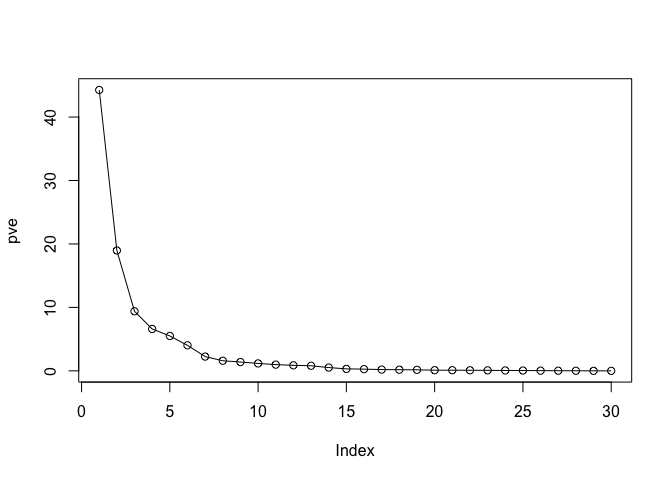
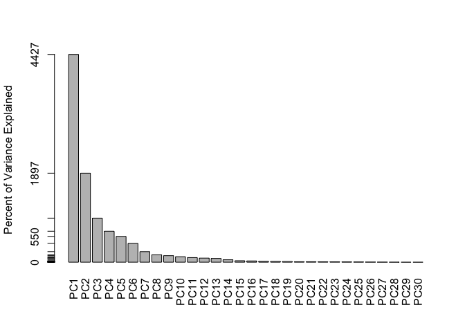
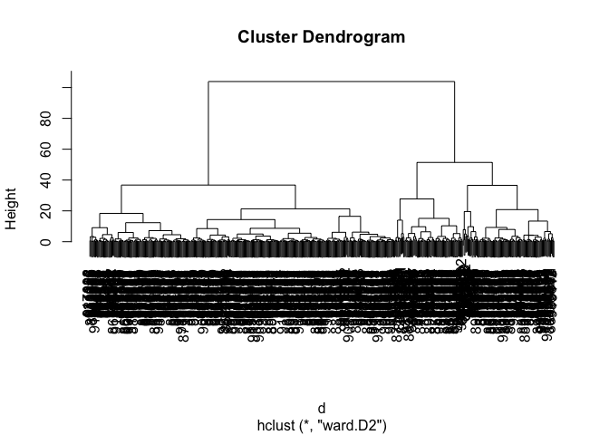
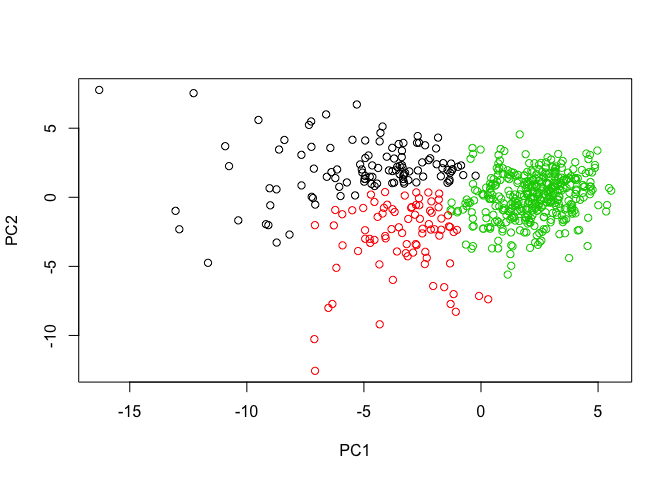
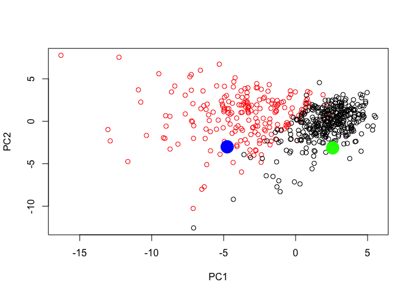

Class09Project
================
Asha Goodman
2/8/2019

``` r
fna.data <- "WisconsinCancer.csv"
wisc.df <- read.csv(fna.data)
```

Always double check your data...

``` r
head(wisc.df)
```

    ##         id diagnosis radius_mean texture_mean perimeter_mean area_mean
    ## 1   842302         M       17.99        10.38         122.80    1001.0
    ## 2   842517         M       20.57        17.77         132.90    1326.0
    ## 3 84300903         M       19.69        21.25         130.00    1203.0
    ## 4 84348301         M       11.42        20.38          77.58     386.1
    ## 5 84358402         M       20.29        14.34         135.10    1297.0
    ## 6   843786         M       12.45        15.70          82.57     477.1
    ##   smoothness_mean compactness_mean concavity_mean concave.points_mean
    ## 1         0.11840          0.27760         0.3001             0.14710
    ## 2         0.08474          0.07864         0.0869             0.07017
    ## 3         0.10960          0.15990         0.1974             0.12790
    ## 4         0.14250          0.28390         0.2414             0.10520
    ## 5         0.10030          0.13280         0.1980             0.10430
    ## 6         0.12780          0.17000         0.1578             0.08089
    ##   symmetry_mean fractal_dimension_mean radius_se texture_se perimeter_se
    ## 1        0.2419                0.07871    1.0950     0.9053        8.589
    ## 2        0.1812                0.05667    0.5435     0.7339        3.398
    ## 3        0.2069                0.05999    0.7456     0.7869        4.585
    ## 4        0.2597                0.09744    0.4956     1.1560        3.445
    ## 5        0.1809                0.05883    0.7572     0.7813        5.438
    ## 6        0.2087                0.07613    0.3345     0.8902        2.217
    ##   area_se smoothness_se compactness_se concavity_se concave.points_se
    ## 1  153.40      0.006399        0.04904      0.05373           0.01587
    ## 2   74.08      0.005225        0.01308      0.01860           0.01340
    ## 3   94.03      0.006150        0.04006      0.03832           0.02058
    ## 4   27.23      0.009110        0.07458      0.05661           0.01867
    ## 5   94.44      0.011490        0.02461      0.05688           0.01885
    ## 6   27.19      0.007510        0.03345      0.03672           0.01137
    ##   symmetry_se fractal_dimension_se radius_worst texture_worst
    ## 1     0.03003             0.006193        25.38         17.33
    ## 2     0.01389             0.003532        24.99         23.41
    ## 3     0.02250             0.004571        23.57         25.53
    ## 4     0.05963             0.009208        14.91         26.50
    ## 5     0.01756             0.005115        22.54         16.67
    ## 6     0.02165             0.005082        15.47         23.75
    ##   perimeter_worst area_worst smoothness_worst compactness_worst
    ## 1          184.60     2019.0           0.1622            0.6656
    ## 2          158.80     1956.0           0.1238            0.1866
    ## 3          152.50     1709.0           0.1444            0.4245
    ## 4           98.87      567.7           0.2098            0.8663
    ## 5          152.20     1575.0           0.1374            0.2050
    ## 6          103.40      741.6           0.1791            0.5249
    ##   concavity_worst concave.points_worst symmetry_worst
    ## 1          0.7119               0.2654         0.4601
    ## 2          0.2416               0.1860         0.2750
    ## 3          0.4504               0.2430         0.3613
    ## 4          0.6869               0.2575         0.6638
    ## 5          0.4000               0.1625         0.2364
    ## 6          0.5355               0.1741         0.3985
    ##   fractal_dimension_worst  X
    ## 1                 0.11890 NA
    ## 2                 0.08902 NA
    ## 3                 0.08758 NA
    ## 4                 0.17300 NA
    ## 5                 0.07678 NA
    ## 6                 0.12440 NA

Looks like there is a funny last column :x:. Lets check how many samples (i.e. patients) and features (i.e. cols) are in this data We want to find out how many patients, nrows tells us how many subjects..

``` r
#number of patients
nrow(wisc.df)
```

    ## [1] 569

``` r
# number of patients
ncol(wisc.df)
```

    ## [1] 33

``` r
# To get both, use dim
dim(wisc.df)
```

    ## [1] 569  33

``` r
# Want to get rid of patient ID (may want it in the future but for now we don't), and funny column, so take col 3 - 32
wisc.data <- wisc.df[,3:32]
head(wisc.data)
```

    ##   radius_mean texture_mean perimeter_mean area_mean smoothness_mean
    ## 1       17.99        10.38         122.80    1001.0         0.11840
    ## 2       20.57        17.77         132.90    1326.0         0.08474
    ## 3       19.69        21.25         130.00    1203.0         0.10960
    ## 4       11.42        20.38          77.58     386.1         0.14250
    ## 5       20.29        14.34         135.10    1297.0         0.10030
    ## 6       12.45        15.70          82.57     477.1         0.12780
    ##   compactness_mean concavity_mean concave.points_mean symmetry_mean
    ## 1          0.27760         0.3001             0.14710        0.2419
    ## 2          0.07864         0.0869             0.07017        0.1812
    ## 3          0.15990         0.1974             0.12790        0.2069
    ## 4          0.28390         0.2414             0.10520        0.2597
    ## 5          0.13280         0.1980             0.10430        0.1809
    ## 6          0.17000         0.1578             0.08089        0.2087
    ##   fractal_dimension_mean radius_se texture_se perimeter_se area_se
    ## 1                0.07871    1.0950     0.9053        8.589  153.40
    ## 2                0.05667    0.5435     0.7339        3.398   74.08
    ## 3                0.05999    0.7456     0.7869        4.585   94.03
    ## 4                0.09744    0.4956     1.1560        3.445   27.23
    ## 5                0.05883    0.7572     0.7813        5.438   94.44
    ## 6                0.07613    0.3345     0.8902        2.217   27.19
    ##   smoothness_se compactness_se concavity_se concave.points_se symmetry_se
    ## 1      0.006399        0.04904      0.05373           0.01587     0.03003
    ## 2      0.005225        0.01308      0.01860           0.01340     0.01389
    ## 3      0.006150        0.04006      0.03832           0.02058     0.02250
    ## 4      0.009110        0.07458      0.05661           0.01867     0.05963
    ## 5      0.011490        0.02461      0.05688           0.01885     0.01756
    ## 6      0.007510        0.03345      0.03672           0.01137     0.02165
    ##   fractal_dimension_se radius_worst texture_worst perimeter_worst
    ## 1             0.006193        25.38         17.33          184.60
    ## 2             0.003532        24.99         23.41          158.80
    ## 3             0.004571        23.57         25.53          152.50
    ## 4             0.009208        14.91         26.50           98.87
    ## 5             0.005115        22.54         16.67          152.20
    ## 6             0.005082        15.47         23.75          103.40
    ##   area_worst smoothness_worst compactness_worst concavity_worst
    ## 1     2019.0           0.1622            0.6656          0.7119
    ## 2     1956.0           0.1238            0.1866          0.2416
    ## 3     1709.0           0.1444            0.4245          0.4504
    ## 4      567.7           0.2098            0.8663          0.6869
    ## 5     1575.0           0.1374            0.2050          0.4000
    ## 6      741.6           0.1791            0.5249          0.5355
    ##   concave.points_worst symmetry_worst fractal_dimension_worst
    ## 1               0.2654         0.4601                 0.11890
    ## 2               0.1860         0.2750                 0.08902
    ## 3               0.2430         0.3613                 0.08758
    ## 4               0.2575         0.6638                 0.17300
    ## 5               0.1625         0.2364                 0.07678
    ## 6               0.1741         0.3985                 0.12440

Add patient ID as row names of our data.

``` r
# This lists the row names
rownames(wisc.data)
```

    ##   [1] "1"   "2"   "3"   "4"   "5"   "6"   "7"   "8"   "9"   "10"  "11" 
    ##  [12] "12"  "13"  "14"  "15"  "16"  "17"  "18"  "19"  "20"  "21"  "22" 
    ##  [23] "23"  "24"  "25"  "26"  "27"  "28"  "29"  "30"  "31"  "32"  "33" 
    ##  [34] "34"  "35"  "36"  "37"  "38"  "39"  "40"  "41"  "42"  "43"  "44" 
    ##  [45] "45"  "46"  "47"  "48"  "49"  "50"  "51"  "52"  "53"  "54"  "55" 
    ##  [56] "56"  "57"  "58"  "59"  "60"  "61"  "62"  "63"  "64"  "65"  "66" 
    ##  [67] "67"  "68"  "69"  "70"  "71"  "72"  "73"  "74"  "75"  "76"  "77" 
    ##  [78] "78"  "79"  "80"  "81"  "82"  "83"  "84"  "85"  "86"  "87"  "88" 
    ##  [89] "89"  "90"  "91"  "92"  "93"  "94"  "95"  "96"  "97"  "98"  "99" 
    ## [100] "100" "101" "102" "103" "104" "105" "106" "107" "108" "109" "110"
    ## [111] "111" "112" "113" "114" "115" "116" "117" "118" "119" "120" "121"
    ## [122] "122" "123" "124" "125" "126" "127" "128" "129" "130" "131" "132"
    ## [133] "133" "134" "135" "136" "137" "138" "139" "140" "141" "142" "143"
    ## [144] "144" "145" "146" "147" "148" "149" "150" "151" "152" "153" "154"
    ## [155] "155" "156" "157" "158" "159" "160" "161" "162" "163" "164" "165"
    ## [166] "166" "167" "168" "169" "170" "171" "172" "173" "174" "175" "176"
    ## [177] "177" "178" "179" "180" "181" "182" "183" "184" "185" "186" "187"
    ## [188] "188" "189" "190" "191" "192" "193" "194" "195" "196" "197" "198"
    ## [199] "199" "200" "201" "202" "203" "204" "205" "206" "207" "208" "209"
    ## [210] "210" "211" "212" "213" "214" "215" "216" "217" "218" "219" "220"
    ## [221] "221" "222" "223" "224" "225" "226" "227" "228" "229" "230" "231"
    ## [232] "232" "233" "234" "235" "236" "237" "238" "239" "240" "241" "242"
    ## [243] "243" "244" "245" "246" "247" "248" "249" "250" "251" "252" "253"
    ## [254] "254" "255" "256" "257" "258" "259" "260" "261" "262" "263" "264"
    ## [265] "265" "266" "267" "268" "269" "270" "271" "272" "273" "274" "275"
    ## [276] "276" "277" "278" "279" "280" "281" "282" "283" "284" "285" "286"
    ## [287] "287" "288" "289" "290" "291" "292" "293" "294" "295" "296" "297"
    ## [298] "298" "299" "300" "301" "302" "303" "304" "305" "306" "307" "308"
    ## [309] "309" "310" "311" "312" "313" "314" "315" "316" "317" "318" "319"
    ## [320] "320" "321" "322" "323" "324" "325" "326" "327" "328" "329" "330"
    ## [331] "331" "332" "333" "334" "335" "336" "337" "338" "339" "340" "341"
    ## [342] "342" "343" "344" "345" "346" "347" "348" "349" "350" "351" "352"
    ## [353] "353" "354" "355" "356" "357" "358" "359" "360" "361" "362" "363"
    ## [364] "364" "365" "366" "367" "368" "369" "370" "371" "372" "373" "374"
    ## [375] "375" "376" "377" "378" "379" "380" "381" "382" "383" "384" "385"
    ## [386] "386" "387" "388" "389" "390" "391" "392" "393" "394" "395" "396"
    ## [397] "397" "398" "399" "400" "401" "402" "403" "404" "405" "406" "407"
    ## [408] "408" "409" "410" "411" "412" "413" "414" "415" "416" "417" "418"
    ## [419] "419" "420" "421" "422" "423" "424" "425" "426" "427" "428" "429"
    ## [430] "430" "431" "432" "433" "434" "435" "436" "437" "438" "439" "440"
    ## [441] "441" "442" "443" "444" "445" "446" "447" "448" "449" "450" "451"
    ## [452] "452" "453" "454" "455" "456" "457" "458" "459" "460" "461" "462"
    ## [463] "463" "464" "465" "466" "467" "468" "469" "470" "471" "472" "473"
    ## [474] "474" "475" "476" "477" "478" "479" "480" "481" "482" "483" "484"
    ## [485] "485" "486" "487" "488" "489" "490" "491" "492" "493" "494" "495"
    ## [496] "496" "497" "498" "499" "500" "501" "502" "503" "504" "505" "506"
    ## [507] "507" "508" "509" "510" "511" "512" "513" "514" "515" "516" "517"
    ## [518] "518" "519" "520" "521" "522" "523" "524" "525" "526" "527" "528"
    ## [529] "529" "530" "531" "532" "533" "534" "535" "536" "537" "538" "539"
    ## [540] "540" "541" "542" "543" "544" "545" "546" "547" "548" "549" "550"
    ## [551] "551" "552" "553" "554" "555" "556" "557" "558" "559" "560" "561"
    ## [562] "562" "563" "564" "565" "566" "567" "568" "569"

``` r
# But we want to tie the patient ids
rownames(wisc.data) <- wisc.df$id
head(wisc.data)
```

    ##          radius_mean texture_mean perimeter_mean area_mean smoothness_mean
    ## 842302         17.99        10.38         122.80    1001.0         0.11840
    ## 842517         20.57        17.77         132.90    1326.0         0.08474
    ## 84300903       19.69        21.25         130.00    1203.0         0.10960
    ## 84348301       11.42        20.38          77.58     386.1         0.14250
    ## 84358402       20.29        14.34         135.10    1297.0         0.10030
    ## 843786         12.45        15.70          82.57     477.1         0.12780
    ##          compactness_mean concavity_mean concave.points_mean symmetry_mean
    ## 842302            0.27760         0.3001             0.14710        0.2419
    ## 842517            0.07864         0.0869             0.07017        0.1812
    ## 84300903          0.15990         0.1974             0.12790        0.2069
    ## 84348301          0.28390         0.2414             0.10520        0.2597
    ## 84358402          0.13280         0.1980             0.10430        0.1809
    ## 843786            0.17000         0.1578             0.08089        0.2087
    ##          fractal_dimension_mean radius_se texture_se perimeter_se area_se
    ## 842302                  0.07871    1.0950     0.9053        8.589  153.40
    ## 842517                  0.05667    0.5435     0.7339        3.398   74.08
    ## 84300903                0.05999    0.7456     0.7869        4.585   94.03
    ## 84348301                0.09744    0.4956     1.1560        3.445   27.23
    ## 84358402                0.05883    0.7572     0.7813        5.438   94.44
    ## 843786                  0.07613    0.3345     0.8902        2.217   27.19
    ##          smoothness_se compactness_se concavity_se concave.points_se
    ## 842302        0.006399        0.04904      0.05373           0.01587
    ## 842517        0.005225        0.01308      0.01860           0.01340
    ## 84300903      0.006150        0.04006      0.03832           0.02058
    ## 84348301      0.009110        0.07458      0.05661           0.01867
    ## 84358402      0.011490        0.02461      0.05688           0.01885
    ## 843786        0.007510        0.03345      0.03672           0.01137
    ##          symmetry_se fractal_dimension_se radius_worst texture_worst
    ## 842302       0.03003             0.006193        25.38         17.33
    ## 842517       0.01389             0.003532        24.99         23.41
    ## 84300903     0.02250             0.004571        23.57         25.53
    ## 84348301     0.05963             0.009208        14.91         26.50
    ## 84358402     0.01756             0.005115        22.54         16.67
    ## 843786       0.02165             0.005082        15.47         23.75
    ##          perimeter_worst area_worst smoothness_worst compactness_worst
    ## 842302            184.60     2019.0           0.1622            0.6656
    ## 842517            158.80     1956.0           0.1238            0.1866
    ## 84300903          152.50     1709.0           0.1444            0.4245
    ## 84348301           98.87      567.7           0.2098            0.8663
    ## 84358402          152.20     1575.0           0.1374            0.2050
    ## 843786            103.40      741.6           0.1791            0.5249
    ##          concavity_worst concave.points_worst symmetry_worst
    ## 842302            0.7119               0.2654         0.4601
    ## 842517            0.2416               0.1860         0.2750
    ## 84300903          0.4504               0.2430         0.3613
    ## 84348301          0.6869               0.2575         0.6638
    ## 84358402          0.4000               0.1625         0.2364
    ## 843786            0.5355               0.1741         0.3985
    ##          fractal_dimension_worst
    ## 842302                   0.11890
    ## 842517                   0.08902
    ## 84300903                 0.08758
    ## 84348301                 0.17300
    ## 84358402                 0.07678
    ## 843786                   0.12440

We want to find out how many cancer and noncancer data in this set? Table function will produce qauntification of the diagnoses.

``` r
table(wisc.df$diagnosis)
```

    ## 
    ##   B   M 
    ## 357 212

How many of our columns include mean values? We would search column names and the grep function which tells us where in the vector our pattern is.

``` r
# colnames(wisc.data)
grep("mean", colnames(wisc.data))
```

    ##  [1]  1  2  3  4  5  6  7  8  9 10

But how do we quantify these values?

``` r
length(grep("mean", colnames(wisc.data)))
```

    ## [1] 10

Also...

``` r
inds <- grep("mean", colnames(wisc.data))
colnames(wisc.data)[inds]
```

    ##  [1] "radius_mean"            "texture_mean"          
    ##  [3] "perimeter_mean"         "area_mean"             
    ##  [5] "smoothness_mean"        "compactness_mean"      
    ##  [7] "concavity_mean"         "concave.points_mean"   
    ##  [9] "symmetry_mean"          "fractal_dimension_mean"

``` r
# Finally, setup a separate new vector called diagnosis to be 1 if a diagnosis is malignant ("M") and 0 otherwise. Note that R coerces TRUE to 1 and FALSE to 0.

# Create diagnosis vector by completing the missing code
diagnosis <- as.numeric(wisc.df$diagnosis == "M")
diagnosis
```

    ##   [1] 1 1 1 1 1 1 1 1 1 1 1 1 1 1 1 1 1 1 1 0 0 0 1 1 1 1 1 1 1 1 1 1 1 1 1
    ##  [36] 1 1 0 1 1 1 1 1 1 1 1 0 1 0 0 0 0 0 1 1 0 1 1 0 0 0 0 1 0 1 1 0 0 0 0
    ##  [71] 1 0 1 1 0 1 0 1 1 0 0 0 1 1 0 1 1 1 0 0 0 1 0 0 1 1 0 0 0 1 1 0 0 0 0
    ## [106] 1 0 0 1 0 0 0 0 0 0 0 0 1 1 1 0 1 1 0 0 0 1 1 0 1 0 1 1 0 1 1 0 0 1 0
    ## [141] 0 1 0 0 0 0 1 0 0 0 0 0 0 0 0 0 1 0 0 0 0 1 1 0 1 0 0 1 1 0 0 1 1 0 0
    ## [176] 0 0 1 0 0 1 1 1 0 1 0 1 0 0 0 1 0 0 1 1 0 1 1 1 1 0 1 1 1 0 1 0 1 0 0
    ## [211] 1 0 1 1 1 1 0 0 1 1 0 0 0 1 0 0 0 0 0 1 1 0 0 1 0 0 1 1 0 1 0 0 0 0 1
    ## [246] 0 0 0 0 0 1 0 1 1 1 1 1 1 1 1 1 1 1 1 1 1 0 0 0 0 0 0 1 0 1 0 0 1 0 0
    ## [281] 1 0 1 1 0 0 0 0 0 0 0 0 0 0 0 0 0 1 0 0 1 0 1 0 0 0 0 0 0 0 0 0 0 0 0
    ## [316] 0 0 1 0 0 0 1 0 1 0 0 0 0 1 1 1 0 0 0 0 1 0 1 0 1 0 0 0 1 0 0 0 0 0 0
    ## [351] 0 1 1 1 0 0 0 0 0 0 0 0 0 0 0 1 1 0 1 1 1 0 1 1 0 0 0 0 0 1 0 0 0 0 0
    ## [386] 1 0 0 0 1 0 0 1 1 0 0 0 0 0 0 1 0 0 0 0 0 0 0 1 0 0 0 0 0 1 0 0 1 0 0
    ## [421] 0 0 0 0 0 0 0 0 0 0 1 0 1 1 0 1 0 0 0 0 0 1 0 0 1 0 1 0 0 1 0 1 0 0 0
    ## [456] 0 0 0 0 0 1 1 0 0 0 0 0 0 1 0 0 0 0 0 0 0 0 0 0 1 0 0 0 0 0 0 0 1 0 1
    ## [491] 0 0 1 0 0 0 0 0 1 1 0 1 0 1 0 0 0 0 0 1 0 0 1 0 1 0 1 1 0 0 0 1 0 0 0
    ## [526] 0 0 0 0 0 0 0 0 1 0 1 1 0 0 0 0 0 0 0 0 0 0 0 0 0 0 0 0 0 0 0 0 0 0 0
    ## [561] 0 0 1 1 1 1 1 1 0

Now it's time to do PCA!
------------------------

Scaling apply(x, \#, pattern), x is your data, \# = 1 would be rows, 2 is columns, pattern is mean, sd etc. And what it would give us is many sig figs, so rounding to '2' values is better.

When using the prcomp function, the scale function by default is false.

``` r
round( apply(wisc.data,2,sd), 2)
```

    ##             radius_mean            texture_mean          perimeter_mean 
    ##                    3.52                    4.30                   24.30 
    ##               area_mean         smoothness_mean        compactness_mean 
    ##                  351.91                    0.01                    0.05 
    ##          concavity_mean     concave.points_mean           symmetry_mean 
    ##                    0.08                    0.04                    0.03 
    ##  fractal_dimension_mean               radius_se              texture_se 
    ##                    0.01                    0.28                    0.55 
    ##            perimeter_se                 area_se           smoothness_se 
    ##                    2.02                   45.49                    0.00 
    ##          compactness_se            concavity_se       concave.points_se 
    ##                    0.02                    0.03                    0.01 
    ##             symmetry_se    fractal_dimension_se            radius_worst 
    ##                    0.01                    0.00                    4.83 
    ##           texture_worst         perimeter_worst              area_worst 
    ##                    6.15                   33.60                  569.36 
    ##        smoothness_worst       compactness_worst         concavity_worst 
    ##                    0.02                    0.16                    0.21 
    ##    concave.points_worst          symmetry_worst fractal_dimension_worst 
    ##                    0.07                    0.06                    0.02

``` r
wisc.pr  <- prcomp(wisc.data, scale = TRUE)
summary(wisc.pr)
```

    ## Importance of components:
    ##                           PC1    PC2     PC3     PC4     PC5     PC6
    ## Standard deviation     3.6444 2.3857 1.67867 1.40735 1.28403 1.09880
    ## Proportion of Variance 0.4427 0.1897 0.09393 0.06602 0.05496 0.04025
    ## Cumulative Proportion  0.4427 0.6324 0.72636 0.79239 0.84734 0.88759
    ##                            PC7     PC8    PC9    PC10   PC11    PC12
    ## Standard deviation     0.82172 0.69037 0.6457 0.59219 0.5421 0.51104
    ## Proportion of Variance 0.02251 0.01589 0.0139 0.01169 0.0098 0.00871
    ## Cumulative Proportion  0.91010 0.92598 0.9399 0.95157 0.9614 0.97007
    ##                           PC13    PC14    PC15    PC16    PC17    PC18
    ## Standard deviation     0.49128 0.39624 0.30681 0.28260 0.24372 0.22939
    ## Proportion of Variance 0.00805 0.00523 0.00314 0.00266 0.00198 0.00175
    ## Cumulative Proportion  0.97812 0.98335 0.98649 0.98915 0.99113 0.99288
    ##                           PC19    PC20   PC21    PC22    PC23   PC24
    ## Standard deviation     0.22244 0.17652 0.1731 0.16565 0.15602 0.1344
    ## Proportion of Variance 0.00165 0.00104 0.0010 0.00091 0.00081 0.0006
    ## Cumulative Proportion  0.99453 0.99557 0.9966 0.99749 0.99830 0.9989
    ##                           PC25    PC26    PC27    PC28    PC29    PC30
    ## Standard deviation     0.12442 0.09043 0.08307 0.03987 0.02736 0.01153
    ## Proportion of Variance 0.00052 0.00027 0.00023 0.00005 0.00002 0.00000
    ## Cumulative Proportion  0.99942 0.99969 0.99992 0.99997 1.00000 1.00000

``` r
attributes(wisc.pr)
```

    ## $names
    ## [1] "sdev"     "rotation" "center"   "scale"    "x"       
    ## 
    ## $class
    ## [1] "prcomp"

``` r
# This is a basic first plot
biplot(wisc.pr)
```


``` r
# This is going to be our more traditional pca plot
plot( wisc.pr$x[,1], wisc.pr$x[,2] , col = wisc.df$diagnosis, 
     xlab = "PC1", ylab = "PC2")
```


``` r
variance <- wisc.pr$sdev^2
pve <- round((variance/sum(variance))*100,2)
plot(pve, type="o")
```



``` r
pr.var <- pve
head(pr.var)
```

    ## [1] 44.27 18.97  9.39  6.60  5.50  4.02

To get data-driven axeses, see below.

``` r
barplot(pve, ylab = "Percent of Variance Explained",
     names.arg=paste0("PC",1:length(pve)), las=2, axes = FALSE)
axis(2, at=pve, labels=round(pve,2)*100 )
```

 \#\# CLustering in Principal COmponent Space

For hclust we need a distance matrix and wee get this from our PCA results (i.e. wisc.pr$x)

``` r
d <- dist(wisc.pr$x[,1:2])
hc <- hclust(d, method="ward.D2")
plot(hc)
```

 Now we want three maor groups.

``` r
# cutree(hc, k=3) is our command
grps3 <- cutree(hc, k=3)
table(grps3)
```

    ## grps3
    ##   1   2   3 
    ## 112  83 374

Let's color our PCA plot by cluster.

``` r
plot( wisc.pr$x[,1], wisc.pr$x[,2] , col = grps3, 
     xlab = "PC1", ylab = "PC2")
```

 Cross tabulation

``` r
# table(grps3)
table(grps3, diagnosis)
```

    ##      diagnosis
    ## grps3   0   1
    ##     1   0 112
    ##     2  18  65
    ##     3 339  35

``` r
plot( wisc.pr$x[,1:2], col = grps3, 
     xlab = "PC1", ylab = "PC2")
```


``` r
plot(wisc.pr$x[,1:2], col=diagnosis+1)
```

 Prediction function will take our PCA model from before and new cancer cell data and project that data onto our PCA space. So let's bring in the new data.

``` r
url <- "new_samples.csv"
new <- read.csv(url)
npc <- predict (wisc.pr, newdata=new)
```

And now let's plot the new data onto our graphs.

``` r
plot(wisc.pr$x[,1:2], col=wisc.df$diagnosis)
points(npc[,1], npc[,2], col=c("green","blue"), pch=16, cex=3)
```


